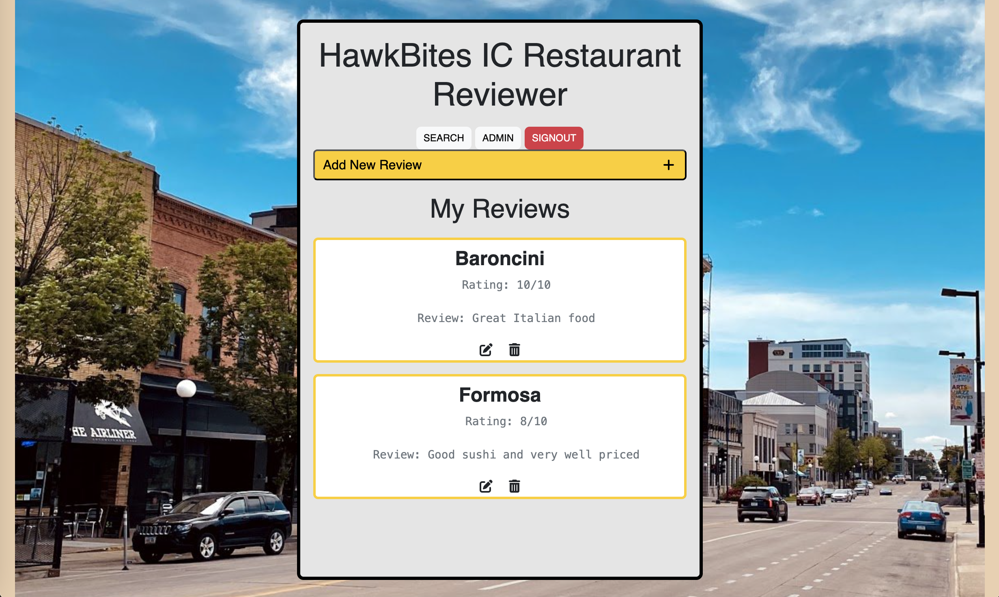
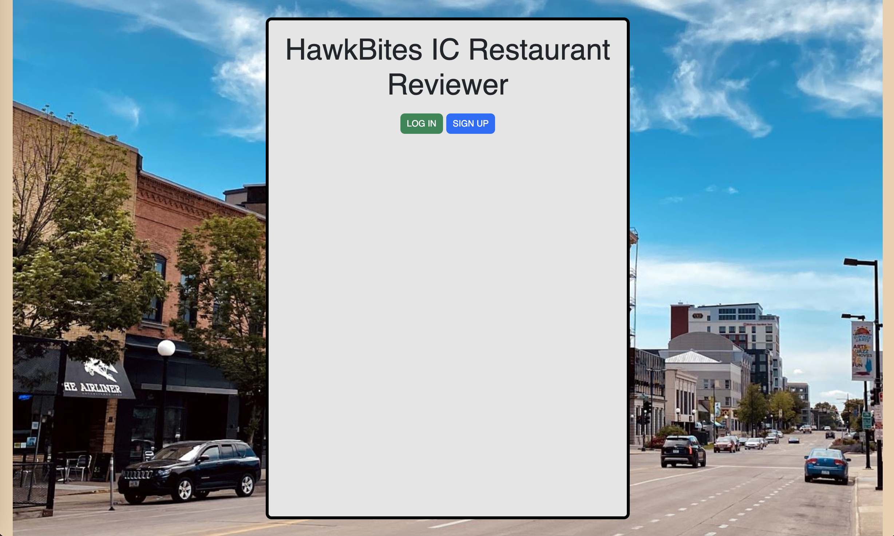
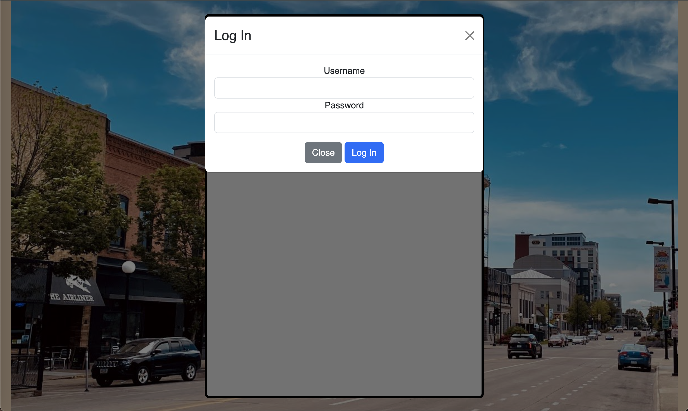
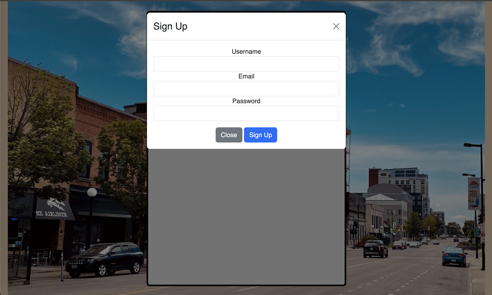
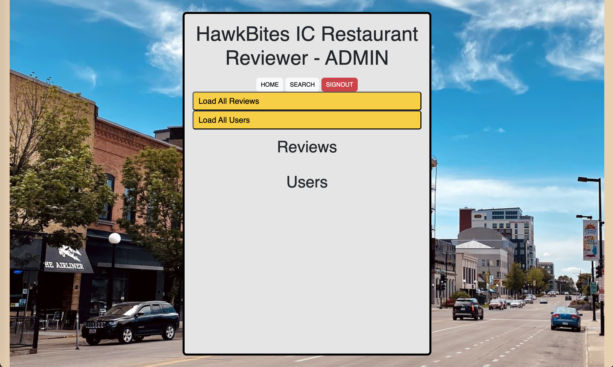
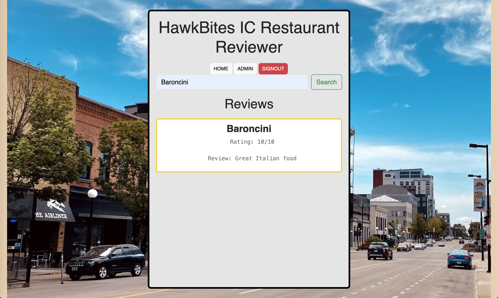

# Midterm Project (Group Final Project updates below)

I made an Iowa City restaurant reviewer web app called HawkBites that allows for users to share their own personal reviews on local restaurants. Each review requires the restaurant name, a rating out of 10, and a review description. This app was an expansion upon our in-class demo Todo App, and I added functionality to share and update ratings as well as redesigning the interface.

## Necessary Packages and Languages

For this project, I mainly used the Uvicorn and FastAPI packages in order to implement CRUD (Create, Read, Update, and Delete) operations for users of the webpage to be able to submit, update, and delete reviews. For languages, I coded the backend in Python, and for the backend I utilized HTML and css to design the interface as well Javascript to handle changes to the webpage contents.

## Usage

In order to use my application, you will first need to clone my repository, ensuring you have all necessary files. Then, you will want to open the project in your preferred code editor, and download all necessary packages. Next, navigate to the correct path in console and enter the following command in order to host the application.

```console
uvicorn main:app --reload
```

Once open, you can locally add, edit, and delete Iowa City restaurant reviews. Upon opening the webpage in your browser, you will be met with this screen: 

From here, you can add a review by clicking the "Add New Review" button which will open a form for you to fill out the contents of your review including the restaurant name, your rating 1-10, and you review description. Once you fill out all fields, you can click "Add" to submit your review, and it will be posted in the reviews section on the main page.


If you change your mind about a review, you can edit it and update it as necessary by clicking the "edit" button of the respective review.


Additionally, you can also delete a review by clicking the "delete" or "trash" icon on the respective review. Make sure that you do not need the review anymore, though, because once the trash icon is clicked the review will be deleted without any extra confirmation.

## Creation

Once again, this project was heavily influenced by our in-class demos and was an expansion upon the Todo App. Most of the changes that I made to the Todo App code were stylistic in order to fit the theme of an IC restaurant review application including changing the appearance in the [style.css](https://github.com/moore025/cs3980/blob/ed9c9a8d57fa327d731d0ed9fd7b57e96bf2eaac/midterm_project/frontend/style.css) file, changing form labels and review output format in the [index.html](https://github.com/moore025/cs3980/blob/ed9c9a8d57fa327d731d0ed9fd7b57e96bf2eaac/midterm_project/frontend/index.html) file, and adding rating functionality to the [model.py](https://github.com/moore025/cs3980/blob/ed9c9a8d57fa327d731d0ed9fd7b57e96bf2eaac/midterm_project/model.py) class as well as updating CRUD operations in [review.py](https://github.com/moore025/cs3980/blob/ed9c9a8d57fa327d731d0ed9fd7b57e96bf2eaac/midterm_project/review.py) and [main.js](https://github.com/moore025/cs3980/blob/ed9c9a8d57fa327d731d0ed9fd7b57e96bf2eaac/midterm_project/frontend/main.js) to handle this additional variable.

## Final Project Updates

We have implemented some major updates for the final version of the HawkBites app that is exhibited in this repository. These changes include: 
- Implementing user login and data persistence functionality using MongoDB
- Adding admin role with advanced permissions such as editing, deleting and viewing users and reviews on a separate webpage
- Search page where users can search for reviews by restaurant
- Added logging and automated testing for better reliability and debugging
- Adding the option for users to upload and attach an image to their review


Here is the new home page after logging in with a username and password: 




#### User Login and Data Persistence with MongoDB
We implemented user authentication using JWT tokens and connected the app to MongoDB for persistent data storage. This allows users to register, log in, and securely manage their accounts, with all user data and reviews stored in a durable database.








#### Admin Role and Permissions
An admin role has been added with elevated permissions. Admins can access a dedicated admin page to view, edit, and delete users and reviews. This provides better moderation and control over the platform’s content and user activity.




#### Review Search Functionality
A search page has been introduced, enabling users to easily find reviews by entering restaurant names. This feature improves user experience by helping them quickly locate relevant feedback before visiting a restaurant.




#### Logging and Testing

We integrated centralized logging across the application to monitor key events such as user sign-ins, failed logins, and admin actions. This helps with both debugging and maintaining a clear activity history. Additionally, we implemented automated tests using pytest to verify the behavior of routes, authentication, and role-based access control. These improvements enhance the reliability and maintainability of the application by catching issues early and providing visibility into system behavior.

#### Attaching images to a review
Again, this is an optional feature for users who captured a picture at the restaurant related to the review e.g. a picture of the food, the environment, decor, etc. The review submission form was updated to include a space for image upload which accepts only .jpg, .jpeg, or .png images. Since this is an optional field, if a user does not have an image to submit, their review will be processed as normal similar to the Midterm project. If they would like to upload an image, though, they can do this and the image will be shown on their review card both on their end as well as anyone who searches for restaurant or looks for the review from the admin page. This was done by storing images as a base64 encoding into the reviews collection in MongoDB along with the associated review. An example of this process is shown below including writing a review, attaching an image (note that you cannot submit a .webp for example since the form only takes .png, .jpg, or .jpeg), and seeing the review with the attached image displayed from your own review page or upon using the search page.


#### Video of Application in Action


